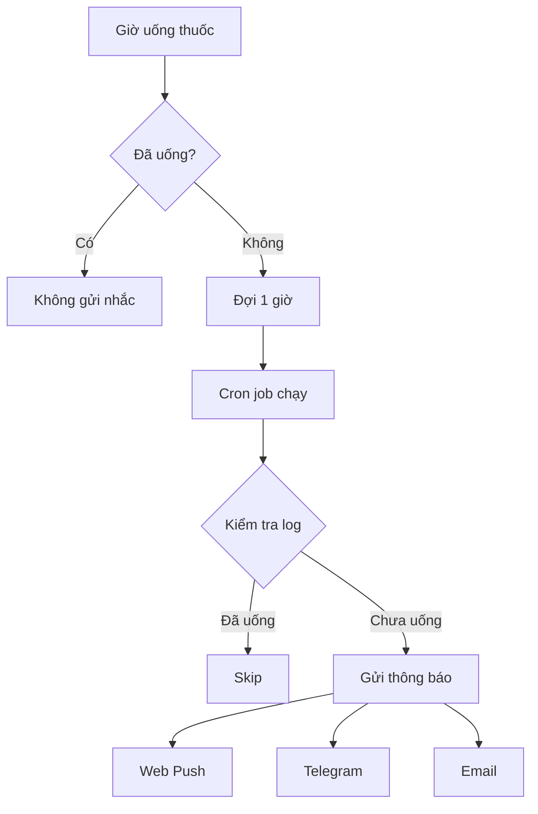

# Hướng dẫn: Nhắc nhở sau 1 giờ nếu chưa uống thuốc

## 📋 Tổng quan

Ứng dụng sẽ tự động gửi thông báo nhắc nhở sau **1 giờ** kể từ giờ uống thuốc nếu bạn chưa đánh dấu là đã uống.

### Lịch nhắc nhở

Ví dụ với giờ uống thuốc mặc định:
- **Giờ uống sáng:** 07:00
  - ⏰ **Nhắc lúc:** 08:00 (nếu chưa uống)
  
- **Giờ uống tối:** 19:30
  - ⏰ **Nhắc lúc:** 20:30 (nếu chưa uống)

- **Kiểm tra cuối ngày:** 23:00
  - 🔔 Gửi tổng hợp nếu còn thiếu bất kỳ liều nào trong ngày

## 🔧 Cấu hình

### 1. Cron Jobs (Vercel)

File `vercel.json` đã được cấu hình với 3 cron jobs:

```json
{
  "crons": [
    {
      "path": "/api/cron/check-morning",
      "schedule": "0 1 * * *"
    },
    {
      "path": "/api/cron/check-evening",
      "schedule": "0 15 * * *"
    },
    {
      "path": "/api/cron/check",
      "schedule": "0 16 * * *"
    }
  ]
}
```

**Lưu ý múi giờ:**
- Vercel Cron sử dụng **UTC**
- Việt Nam = **UTC+7**
- `0 1 * * *` = 08:00 giờ VN (07:00 + 1h)
- `0 15 * * *` = 22:00 giờ VN (21:00 + 1h, giả sử giờ tối là 21:00)
- `0 16 * * *` = 23:00 giờ VN

### 2. Thay đổi giờ uống thuốc

Khi bạn thay đổi giờ uống thuốc trong `/settings`:

1. **Trong UI:** Giờ uống được lưu vào database
2. **Cron schedule:** Vẫn chạy theo giờ cố định trong `vercel.json`

**⚠️ Quan trọng:** Nếu bạn thay đổi giờ uống thuốc khác với mặc định, cần cập nhật `vercel.json`:

#### Ví dụ: Thay đổi từ 07:00 → 08:00 sáng

**Bước 1:** Tính giờ nhắc (giờ uống + 1h)
- Giờ uống: 08:00
- Giờ nhắc: 09:00 VN = 02:00 UTC

**Bước 2:** Cập nhật `vercel.json`
```json
{
  "path": "/api/cron/check-morning",
  "schedule": "0 2 * * *"
}
```

**Bước 3:** Deploy lại lên Vercel
```bash
git add vercel.json
git commit -m "Update morning reminder time to 09:00"
git push
```

### 3. Kiểm tra lịch nhắc hiện tại

Xem giờ nhắc động dựa trên giờ uống thuốc:

```bash
curl http://localhost:3000/api/reminders/schedule | jq .
```

Hoặc truy cập trong UI: `/settings` → Scroll xuống **"⏰ Lịch nhắc nhở tự động"**

## 🧪 Test thủ công

### Test endpoint check-morning
```bash
curl -X POST http://localhost:3000/api/cron/check-morning
```

Response mẫu:
```json
{
  "time": "2026-07-08T07:06:55.921Z",
  "date": "2026-07-08",
  "missing": [
    "Thuốc chính (liều sáng 07:00)"
  ],
  "notified": {
    "push": 0,
    "telegram": true,
    "email": false
  },
  "message": "Đã gửi nhắc nhở cho 1 liều sáng"
}
```

### Test endpoint check-evening
```bash
curl -X POST http://localhost:3000/api/cron/check-evening
```

## 📱 Thông báo

Nhắc nhở sẽ được gửi qua các kênh đã cấu hình:
- ✅ Web Push (nếu đã bật)
- ✅ Telegram (nếu đã cấu hình)
- ✅ Email (nếu đã cấu hình)
- ⏳ Zalo (chưa triển khai)

### Nội dung thông báo

**Nhắc buổi sáng:**
```
⏰ Nhắc nhở: Bạn chưa uống thuốc buổi sáng!

Đã quá 1 giờ kể từ giờ uống thuốc.

Còn thiếu: Thuốc chính (liều sáng 07:00)
```

**Nhắc buổi tối:**
```
⏰ Nhắc nhở: Bạn chưa uống thuốc buổi tối!

Đã quá 1 giờ kể từ giờ uống thuốc.

Còn thiếu: Thuốc chính (liều tối 19:30)
```

## 📊 Logic hoạt động



### Chi tiết code flow

1. **Cron chạy đúng giờ** (ví dụ 08:00 cho liều sáng 07:00)
2. **Đọc thuốc active** từ database
3. **Kiểm tra log hôm nay**:
   - `morningTaken = false` → Thêm vào danh sách missing
   - `morningTaken = true` → Skip
4. **Nếu có missing** → Gọi `notifyAll()` gửi thông báo
5. **Return response** với thông tin đã gửi

## 🔒 Bảo mật

Cron endpoints được bảo vệ bằng `CRON_SECRET`:

```env
CRON_SECRET="your-random-secret-string"
```

Vercel tự động gửi header:
```
Authorization: Bearer <CRON_SECRET>
```

Nếu không có secret hoặc sai → `401 Unauthorized`

## ❓ FAQ

**Q: Tôi thay đổi giờ uống từ 07:00 sang 09:00, tại sao vẫn nhận nhắc lúc 08:00?**

A: Vì cron schedule trong `vercel.json` vẫn cố định. Bạn cần:
1. Cập nhật schedule trong `vercel.json`
2. Commit và push lên GitHub
3. Vercel tự động deploy với cron mới

---

**Q: Có thể tắt nhắc sau 1h không?**

A: Hiện tại chưa có tùy chọn tắt trong UI. Nếu muốn tắt:
- **Tạm thời:** Đánh dấu đã uống trước khi đến giờ nhắc
- **Vĩnh viễn:** Xóa cron job tương ứng trong `vercel.json`

---

**Q: Nếu tôi có nhiều loại thuốc với giờ khác nhau thì sao?**

A: Hiện tại hệ thống lấy thuốc đầu tiên trong danh sách active. Để hỗ trợ nhiều thuốc:
1. Cần thêm cron job riêng cho từng thuốc
2. Hoặc cải tiến logic để check tất cả thuốc trong 1 cron

---

**Q: Local development không có Vercel Cron, test thế nào?**

A: Gọi trực tiếp endpoint:
```bash
curl -X POST http://localhost:3000/api/cron/check-morning
curl -X POST http://localhost:3000/api/cron/check-evening
```

## 🎯 Tổng kết

✅ **Đã có:**
- Nhắc sau 1h nếu chưa uống (sáng & tối)
- UI hiển thị lịch nhắc trong Settings
- API để xem lịch động: `/api/reminders/schedule`
- Test endpoints: `check-morning`, `check-evening`

⚠️ **Lưu ý:**
- Cron schedule cố định trong `vercel.json`
- Thay đổi giờ uống → cần update cron và deploy
- UI settings sẽ cảnh báo điều này

🔗 **Liên quan:**
- `TELEGRAM_SETUP.md` - Cấu hình Telegram
- `ZALO_SETUP.md` - Cấu hình Zalo (tương lai)
- `README.md` - Tổng quan dự án
